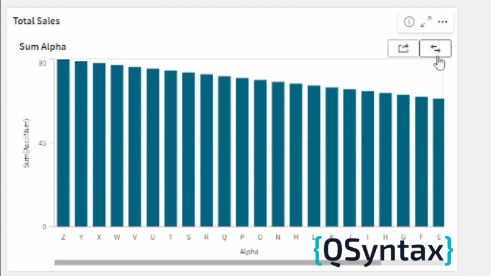

# Why use the Flipcard Extension?

   

If you’ve ever tried to display multiple KPIs, charts, or comparisons on a single dashboard, you know how visual space can quickly become a bottleneck.

The **Flipcard Extension** tackles this challenge with a touch of innovation: by toggling between two master items in the same space, it reduces the need for scrolling, tabs, or additional filters.

It’s especially useful in scenarios such as:

- Toggle between current vs. historical performance indicators  
- Display a chart and a table on the same topic  
- Show two analysis perspectives (e.g., revenue vs. cost)  
- Compare results from different periods without taking up two areas on the dashboard  

This extension delivers more content in less space, enhances the user experience, and keeps the focus where it should be: **on data analysis**.
